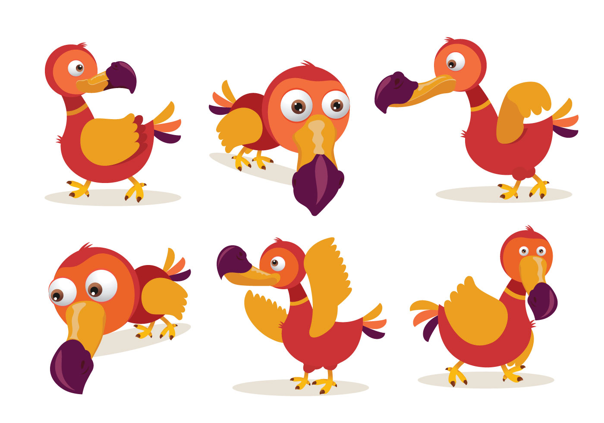

<!--Son titulos-->

## ¿Qué es Dodo CMR?

Dodo CRM es un software que funciona como un servidor en la nube (SaaS - Software as a Service) que permite administrar la relación con tus clientes. **Dodo CRM** te ayuda a incrementar las ventas, ya que tendrás, en todo momento, el control de tus datos desde que se genera una nueva oportunidad de negocio (por ejemplo, el registro de un contacto interesado en tu producto o servicio) hasta que se concrete o se cierre la venta con una factura. Además, podrás dar un efectivo servicio *post-venta* utilizando el módulo de *mesa de ayuda* de **Dodo CMR**.  
 
## Dodo CMR para empresas prestadoras de servicios. 

**Dodo CMR** puede ser activdo para empresas contratistas o de ingeniería que prestan servicios a usuarios finales. Por ejemplo, empresas que construyen o hacen inspecciones de redes de gas natural. 
Con **Dodo CRM** tendrás un control efectivo de los siguientes aspectos: 
* Gestión de órdenes de trabajo
* Programación de las visitas técnicas (inspección o construcción) de las redes de gas natural
* Almacenamiento de todo el registro fotográfico que se genera en cada visita a los usuarios finales. 
* Almacenamiento de otros tipos de documentos electrónicos (.pdf, .docx, .xlsx, video, etc)
* Generación del cobro final (factura) a tu cliente o empresa contratante.
* Gestión de las PQRS (Peticiones, quejas, reclamos y sugerencias)
* Carga masiva de datos
* Informes de gestión   

## ¿Por qué es importante tener un software CRM en tu empresa?

Un software CRM forma parte de una estrategia organizacional en la cual todas las acciones tienen el objetivo final de mejorar la atención y relaciones con los clientes (fidelización), además de generar nuevos prospectos o clientes potenciales. Una herramienta CRM proporciona resultados demostrables, tanto por disponer de una gestión comercial estructurada y que potencia la productividad en las ventas, como por ofrecer un conocimiento profundo del cliente que permite plantear campañas de marketing más efectivas.  

Las funciones de atención al cliente de una herramienta CMR potencia además la fidelización y satisfacción de los clientes, lo que tiene un impacto muy positivo en términos de ventas recurrentes.    

## Conéctate con tus clientes con las funciones de Dodo CRM
* Contacto
* Clientes
* Proyectos
* Proveedores
* Productos / Clientes
* Tareas
* Módulo documental
* Mesa de ayuda
* Órdenes de trabajo
* Visitas técnicas
* Informes de gestión
